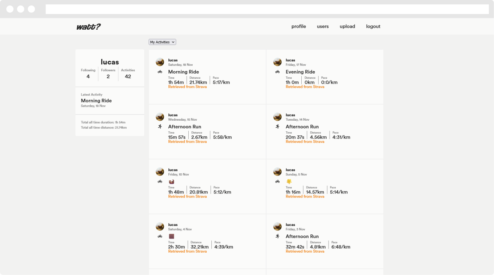
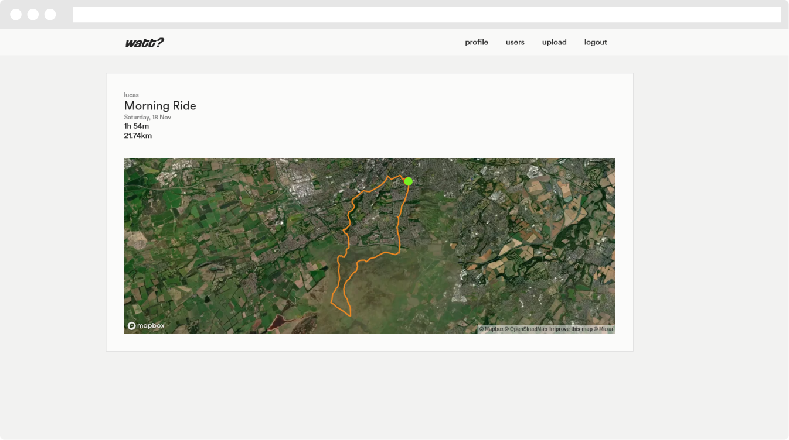
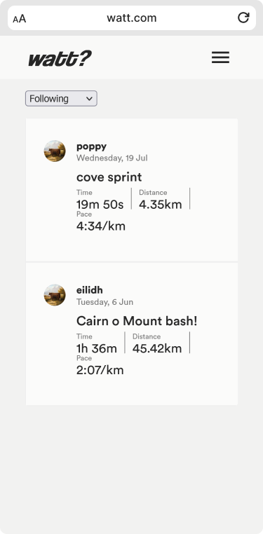

# Watt?

Watt? is a social posting and data viewing app for your training.

## Technical Stack

Fullstack web-app built using Vite/React frontend, Express/Node.js backend and Postgresql database.

## MVP

The Minimum Viable Product for this website ecompasses the following:

1. Authentication System

    1. Ability to register an account with a password and unique username.
    2. Login and gain access to website using registered credentials.
    3. Protect internal website pages verifying user authentication upon requests.
    4. Logout user and destroy session key.

2. Activity Posting

    1. Create activity post, either manually or through reading uploaded GPS data.
    2. Store user posts in postgres table for later retrieval.
    3. delete or update post after posting.

3. Following System

    1. Ability to 'follow' fellow website users and subscribe to seeing there posts on your home 'feed'
    2. Unfollow previously followed users.
    3. Build a custom feed for each user comprised of posts made by their following list.

## Further Technologies

-   mapbox
-   passport.js
-   strava API

## Product Gallery

### Activity Page

### Mobile View

